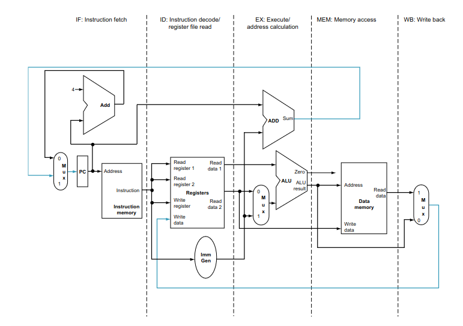
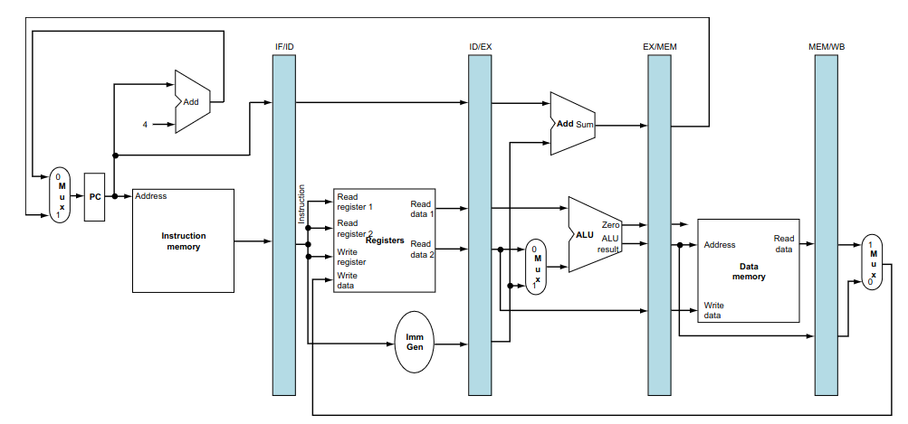
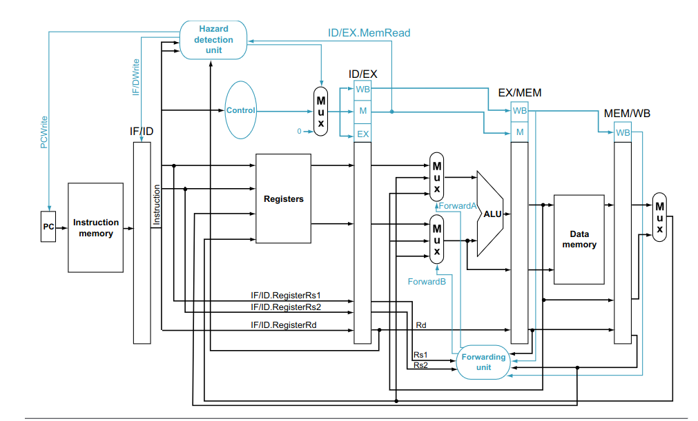
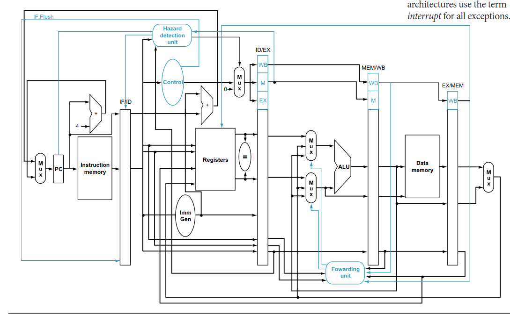
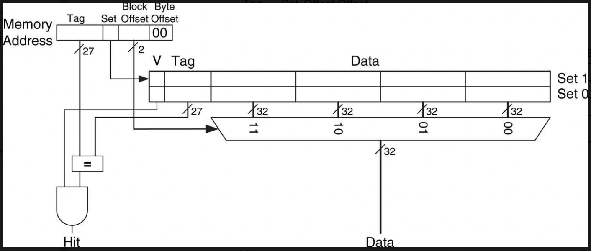
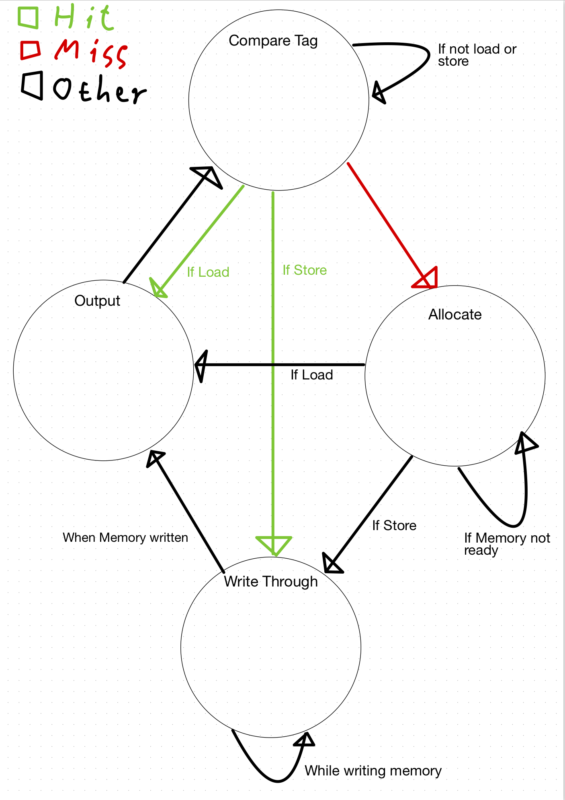
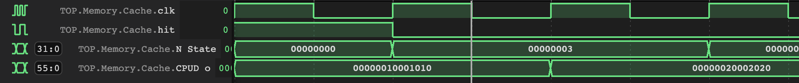
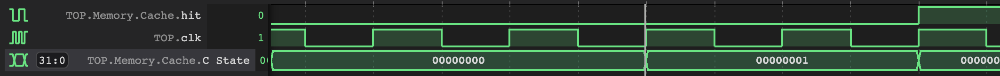
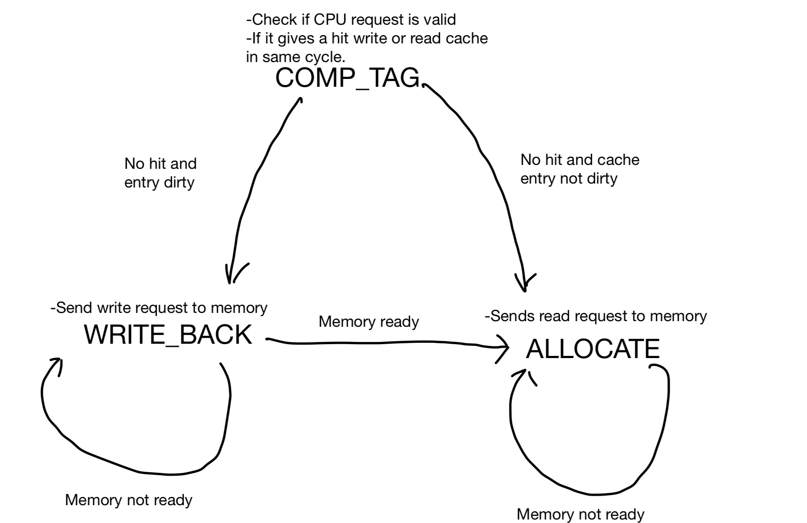
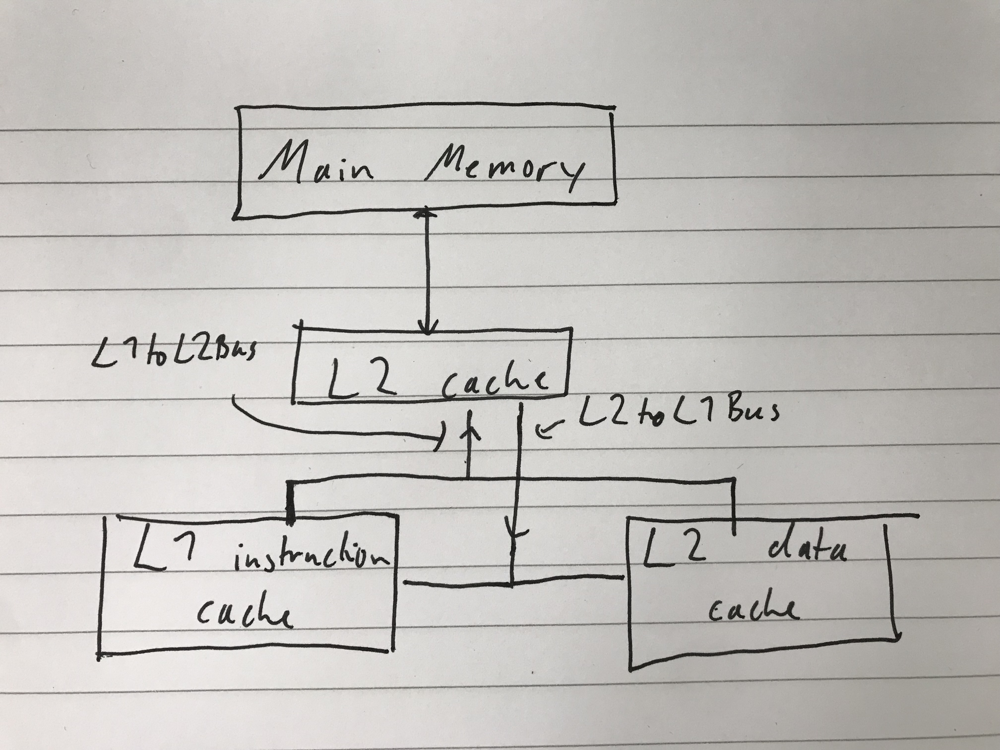

# Pipelined RISC-V CPU with Caching in Systemverilog

## Summary of results

We managed to implement a fully pipelined RISC-V CPU (with hazard detection and forwarding) which also uses single level caching.

In a different branch (`neumann_multilevel`) we were even able to implement
a two level caching mechanism with split L1 cache for instructions and data and
unified L2 cache as well as main memory for both of them. This required dealing
with cache coherence between the two L1 caches and adding extra hazard detection
mechanisms to deal with writes to instruction memory.

## Team members and personal statements

| Name           | GitHub   | Link to Personal Statement|
|----------------|----------|----------|---------------------------|--------------|
| Xiaoyang Xu | **X454XU** | [Xiaoyang Xu's Statement](statements/XiaoyangXu.md) |
| Constantin Kronbichler    | **ccrownhill** | [Constantin's Statement](statements/ConstantinKronbichler.md) |
| Yixu Pan| **YixuPan** | [Yixu Pan's Statement](statements/YixuPan.md) |
| | **ManofRenown** | [ManofRenown's Statement](statements/ManofRenown.md) |


## Repository structure

### Files and directories

* `rtl`: contains all SystemVerilog code
  * `riscvpipe.sv`: top level module
  * one top level module for every stage
  * ...

* `test`
  * Makefile for testing
  * assembly code and machine code
  * files to load into memory (e.g. distributions)

* `utilscripts`: scripts for converting between binary formats of memory files or machine code
  * `mem_to_bloc.py` to convert data memory file from bytes to n bit blocks
  * `TabRemove.py` to format code correctly
  * ...

* `memtest`: test bench to test caching in isolation from rest of CPU; SystemVerilog modules are not up-to-date anymore

* `SingleCycleCPU`: the single cycle implementation (included just for reference)

### Branches

All of them are pipelined versions with 5 stage pipeline:

* `main`: 2 level von-Neumann cache:
	* split instruction and data cache for L1 (with write through)
	* uses simple write through snooping protocol for cache coherence between the two
	L1 caches
	* unified L2 cache (with write back)
	* Unified main memory


* `writethrough_caching`: contains pipelined CPU with forwarding and hazard detection along with single level write through caching

* `writeback_caching`: implements single level writeback caching
* `neumann_cache`: implements a split instruction and data cache
with a unified main memory

## Part 1: Single Cycle CPU

### Design

We referred to the book written by Harris & Harris, Control Unit as:


ALU section as:


ImmSrc as:


finally, the whole design as


### Evidence

See the [test directory README](./test/README.md#single-cycle).

## Stretch Goal 1: Pipelined RV32I Design

Note that all the graphics from this section come from the textbook "Computer Organization and Design RISC-V Edition: The Hardware Software Interface" by David Patterson and John Hennessy.

### Design

We chose to do a standard five stage pipeline

* `IF` Instruction Fetch
  * read instructions from instruction memory
  * PC register
  * `IF/ID` register between this and next stage
* `ID` Instruction Decode
  * decodes instruction into control signals
  * reads data from register file
  * `ID/EX` register between this and next stage
* `EX` Execute
  * computes ALU result
  * `EX/MEM` register between this and next stage
* `MEM` Memory
  * writes/reads the data memory
  * also writes new value of PC to input of PC register; the reason for this is that the PC register will introduce another cycle delay until its output changes; hence, we change it already before the last stage
  * `MEM/WB` register between this and next stage
* `WB` Write Back
  * writes data from memory or data from ALU output or next PC value (`jal`) to register file



**IMPORTANT**: to avoid unnecessary extra stalls we designed the register file in
a slightly unconventional way into a latch

* it will be written during the entire first half of a clock cycle (clock high)
* it will be read in the second half

```verilog
always_latch begin
  if (clk == 1'b1) begin
    // AD3 != 0 because writing zero register has to stay 0	
    if (WE3 && AD3 != {ADDRESS_WIDTH{1'b0}}) begin
      reg_file[AD3] = WD3;   // Write data to port 3
    end
  end
  else if (clk == 1'b0) begin
    RD1 = reg_file[AD1];
    RD2 = reg_file[AD2];
    a0_o = reg_file[10];
  end
end
```

We know that this can also be done by configuring all other pipeline registers as
well as the register file to write on the negative edge of the clock and read
the register file on the positive edge but we sticked to this version because
it was already in place when we learned about the other option and it was best to
avoid merge conflicts with current development changes.


Pipelining was implemented in multiple steps:

**1. Insert pipeline registers between stages**

As in this picture we just inserted pipeline registers between the different stages.
These received all output signals of one stage as well as the control signals
that need to be passed to the next stage.



That way it is possible to execute multiple different stages in parallel which means
less combinational logic needs to be done in one clock cycle which allows a big speedup.

In theory this gives a speedup up to `N` for `N` stages but in practice not all stages execute as fast
as the other stages and we also need to introduce stalls.

**2. Avoiding hazards**

There are two types of hazards in a pipelined CPU:

* *Data Hazards*: when an instruction needs data from a previous instruction that
has not yet reached the write back stage --> use FORWARDING
* `Control Hazards`: when we load a wrong instruction because the branch condition
of a branch instruction was not yet evaluated --> use stalls, move logic up in the pipeline, predicted fetches, and flush registers to delete predicted instruction load

**2.1. Avoiding data hazards**

In the `EX` stage in `ForwardingUnit.sv` we decide where our ALU operands should
come from:

* from the register file (if it contains the most up-to-date versions of what we need)
* from the ALU output stored in the `EX/MEM` register (if one operand is the output of the previous ALU instruction that was not yet written to memory)
* from the WB stage register file input if we need the second last instructions output

Then we use two MUXes for each operand that select the correct of these (the `Sel`
input comes from `ForwardUnit.sv`).

Why we need to stall for memory load instruction forwarding: Memory instruction output
is only available after the `MEM` stage that means that if the last instruction
before the current instruction is a `MEM` instruction its memory output will not
be available while the current instruction is starting the EX stage.
Hence we will stall for one cycle.

How to stall in `HazardDetectionUnit.sv`

* checks whether conditions for stall are fulfilled
	* whether stages further up will write to the register file at the same address
	as the current instruction
	* whether we have a memory load instruction in the MEM stage (then we need to stall)
* sets PC register enable and `IF/ID` register enable low
* sets all control signals in `ID` stage to zero so that we will not be writing to
the register file or memory during the stall



**2.2. Avoiding control hazards**

Here we employed a smart technique to reduce the amount of stalls to 0 if the branch
condition does not make use of a register edited in the previous two instructions and
if our prediction of "branch not taken" was correct.

This was done by moving logic into the ID stage:

* comparing register operands directly from output of register file
* calculate PC + Immediate operand so that we don't need to wait for the EX stage

This means that in many cases all the information which instruction to load in the
following IF stage will be available and we don't need to stall.

However, we loose a cycle or two in the following scenarios:

1. 1 lost cycle: branch taken means that we already loaded the value at PC+4 from
the instruction memory while the new PC will only show on the PC register output
the next cycle. This means we need to set the instruction in the `IF/ID` register
to 0 to make it like a nop

1. up to 2 lost cycles: if the branch depends on the previous instruction's output
we need to stall for 2 cycles until the result is in the register file or 1 cycle
if it was the second last instruction's output.

The Hazard Detection unit was extended to allow for flushing:

* it flushes under this condition: (`Branch_i` for branch instruction, `BranchCond` when condition is fulfilled, `Jump` for `jal` instruction and `Ret` for `jalr` instruction as set in decode logic of `ID` stage):

```verilog
((Branch_i == 1'b1 && BranchCond_i == 1'b1) || Jump_i == 1'b1 || Ret_i == 1'b1)
```

* it stalls under this condition (up to two cycles when register for comparison
was not yet written):

```verilog
if ((Branch_i == 1'b1 || Ret_i == 1'b1) // check if it is branch or jalr 
// check whether instruction in EX stage will write to register file         
&&    ((((rs1_IF_ID_i == rd_ID_EX_i || rs2_IF_ID_i == rd_ID_EX_i) && rd_ID_EX_i != 5'b0) && RegWrite_ID_EX_i == 1'b1)
// check whether instruction in MEM stage will write to register file        
    || (((rs1_IF_ID_i == rd_EX_MEM_i || rs2_IF_ID_i == rd_EX_MEM_i) && rd_EX_MEM_i != 5'b0) && RegWrite_EX_MEM_i == 1'b1)))
```

Note the checks to ignore writes to the zero register because these will not change
anything and should therefore not result in stalls.



### Evidence

See the [test directory README](https://github.com/ccrownhill/riscv_cpu/tree/main/test#pipelined-cpu).

## Stretch Goal 2: Pipelined RV32I Design with Cache

### Initial planning

This is the overall design we have chosen.

Cache size: 128 Words total capacity which is 512 bytes.
4 degrees of associative: Tracking least used by splitting the ways into two groups, tracking the least used group and randomly eliminating a way within the least used group when necessary.
16 Bytes in a block 
8 Sets total
4 blocks in a set
total number of blocks = 32
We will only have one level of cache. (To begin)
We will initially have a writethrough cache.

This is an example of a cache. For our purposes the 32 bit input to the mux will be 8 bit and our mux will be much larger to enable every byte to be individually addressed.


Inputs and outputs names:
Top Level Memory:  Memory.sv
on startup all data should be wiped and all V bits set to 0
inputs: 
- clk
- Addr_i [31:0]
- WriteD_i [31:0]
- Mwrite_i
- Mread_i
- funct3_i [2:0]
- ReadD_o [31:0]
- Mready_o

The cache itself: Cache.sv
- Valid_i
- Wen_i
- funct3_i [2:0]
- Addr_i [31:0] // this will form the various parts of the address such as tag and byte offset.
- WordData_i[31:0]
- HalfData_i [15:0]
- ByteData_i [7:0] 
- clk
- WordData_o [31:0]
- HalfData_o [15:0]
- ByteData_o [7:0] 
- Cready_o

The main memory: MainMemory.sv
- Valid_i
- Wen_i
- clk
- Addr_i [31:0]
- WriteD_i [127:0]
- ReadD_o [127:0] // on a miss the cache is updated with the missing block. Then the cache will read the desired byte and output it back to the cpu
- Ready_o

The 16 mux: Mux16.sv
Follows conventions of previous Muxs

Sign extender for the byte and half word outputs: MemExtend.sv
- WordData_i[31:0]
- HalfData_i [15:0]
- ByteData_i [7:0] 
- funct3_i [2:0]
- ExtD_o [31:0]

To split up this task we have done:
Constantin will be integrating the modules into the CPU.
Orlan will create Cache.sv
Pan will create MainMemory.sv and MemExtend.sv
Seb will create Mux16.sv and helping others with any issues

Introducing caching into our CPU was a very large task and because of the nature of the task it was very important to have set variable names. This would make connecting it in the top level much easier. It was a very fun but challenging task and we worked well as a team to achieve it. We decided to only implement l1 cache as this would be enough for our purposes.

The largest design choice we made was certainly making the cache byte addressed. We realised that the test program only used LB and SB instructions. This means that we could make better use of a cache by making it byte addressable. In this way we increased the amount of data our cache could store without increasing the size of it. We picked the size of our cache to be a reasonable size that could theoretically be implemented in a real CPU. Our block size was chosen to be quite large as we realised for the programs we will be running spatial locality would be very helpful in increasing the hit rate.

Testing the performance improvements from the cache is difficult as we cannot simulate different delay times with fetching values from memory very easily. However assuming that our cache allows us to fetch form l1 in 2 cycle and form main memory in 100 cycles our cache should enable a significant speed increase in a real CPU. This is probably the single biggest improvement to our CPU we have made as pipelining our CPU with 5 stage could cause between a 3-5 times increase in clock frequency, but the cache could be 10 times faster assuming a decent hit rate.

The cache is 4 way set associative which should allow it to hold a large amount of data for plotting different distributions but in the case where some data must be replaced it selects the last used way using a shift register which allows us to make use of temporal locality. In these ways we take advantage of the principles of both spatial and temporal locality which again should improve our hit rate.

The cache itself was implemented using a state machine which tracks what needs to be done by moving through the stages before outputting the correctly fetched value or writing the correct block in memory and awaiting the next instruction. There is logic in the hazard detection to make sure that if there is a delay, from not getting a cache hit or from a write instruction, the pipeline is stalled until this instruction is executed fully. We have not implemented out of order execution.

Here is a state machine for the write through cache:


### Next Steps

If given more time there are two features that would be very interesting to implement. Including out of order execution would certainly speed up the CPU as we could have the cache operating somewhat independently of the main CPU. For example if a write instruction was followed by many register instructions we would not have to stall as the cache could write memory while the register instructions happen in parallel. Another very interesting feature would be pre-fetching instructions. This would be a huge speedup as it would allow us to massively improve our hit rate. With the sample program in particular this would be an 100% hit rate as the plotting of the distribution is massively predictable. This would be the most interesting feature as writing an effective algorithm would be a fascinating challenge.

### Performance

Our performance for our cache cannot be measured in real time but we can assess the hit rate which is an indicator as to how well it will perform. In the example program we achieve an average hit rate of 94%. This is because the example program is very predictable. Since it accesses data incrementally every single byte in our block will be accessed. Because of this the only misses we have are when crossing a cache boundary and thus causing a new block to be fetched. As we do not have prefetching these are mandatory misses and so the only improvements we could make would be either increasing the number of bytes in a block. Or implementing some method of prefetching. 



This shows that hit has gone high in a previous state comparing tags. From there the next state is the Output stage (state 3) where the output of the cache is changed to the new correct output value. Then the cache will signal it is ready for a new instruction and change state again on the next clock cycle to compare tags for the next value.



This shows a miss where the data has not been found in the cache so we move to the allocate stage. This is where we fetch the block we need from the memory and write it into the cache. This was a read instruction so the next stage is the output stage where the correct data will be outputted to the CPU. The block is now stored in the cache so later if needed later it can be retrieved and outputted much faster.

More cycles are used when running the program with the cache as misses add cycles that otherwise would not be there. However assuming a good hit rate there is minimal increase to the number of cycles. If we take into account the theoretical increase from the cache allowing faster reading than main memory it is clear our cache would massively speed up the CPU as a whole.

### Performance comparison to write back cache

Our final version is a write through cache as we thought this was our best version overall. However we did also implement a faster write back cache. This is because it did not have to write main memory every time a cache location was updated. This comes with its own issues however as your main memory and cache memory are not synchronised which causes issues when overwriting a cache location that stores data not yet written to main memory. This requires use of a dirty bit and when it is required to write to main memory there is a large delay because of this since you must write main memory then read the new data and finally rewrite the cache. This means that while write back may be more efficient overall there is more consistency with a write through cache and it offers a more than good enough performance increase while keeping testing and implementation much simpler.
So in the end we picked our write through cache as our final result due to a greater confidence in the design and minimal performance difference between the two designs.

Here is a state machine for the Write Back cache:


When comparing a run of the Gaussian distribution PDF generation program we can compare at what time they start to display the distribution:

* Write Back: 358666ps
* Write Through: 504550ps

This shows that the write back cache outperforms the write through cache
by almost a factor of 2.

This is due to less writes to memory.

### Evidence

See the [test directory README](https://github.com/ccrownhill/riscv_cpu/blob/main/test/README.md#caching)


## Multilevel caching with unified main memory, L2 cache and split L1 caches

As an extra challenge a multilevel caching system was implemented in the `neumann_multilevel` branch.
As the branch name suggests it also implements a von-Neumann memory model, i.e.
a shared memory for both instructions and data.

### Motivation

Almost all modern CPUs use a von-Neumann architecture as well as multilevel caching with
a split first level cache.
Hence, it was my goal to try to implement a more realistic CPU by adding this to our design.

### Main Memory

`MainMemory.sv`

Since $2^32$ bytes would be too big for our memory the memory just contains two
SystemVerilog arrays and decides which one to read from based on the input address.

This was done with this simple Macro:

```verilog
`define WRITE_MAINMEM(ADDR, DATA) \
	if (ADDR >= {32'hbfc00000}[31:BYTE_ADDR_BITS]) \
		mem_arr_ins[ADDR-{32'hbfc00000}[31:BYTE_ADDR_BITS]] <= DATA; \
  else \
    mem_arr_data[ADDR] <= DATA;
```

### L2 cache

`L2Cache.sv`

The L2 cache is a simple write back cache with the only difference to the previous
caches that it now reads and writes whole blocks directly.

### Split L1 caches and the problem of cache coherence

`L1Data.sv` for the data cache and `L1Instr.sv` for the **read-only** instruction cache.

The most interesting part comes from dealing with two separate L1 caches that both
communicate with the L2 cache.

The main problem arises when one cache wants to read from memory that the other cache
has just written. Assume both `L1Data` and `L1Instr` have a cached copy of data at address `x`.
When `L1Data` writes to address `x` and `L1Instr` receives a read request at address `x`
it will return an outdated value.

The solution for this is to make the L1 caches **snooping caches** which means
that they are connected to a common input and output bus with the L2 cache, as in this image:



Note that both L1 caches are implemented as write through caches.
Now, whenever `L1Data` sends a write request on the bus to L2 (happens on every write because we use write through)
`L1Instr` will *snoop* this request from the bus going to the L2 cache and invalidate
its entry at that address (if it has it).
This means a new read request to `L1Instr` for address `x` has to ALLOCATE the updated
value from the L2 cache.

The busses were implemented by using one struct to define all of their bits:

```verilog
typedef struct packed {
  logic           Valid;
  logic           Wen;
  logic           Src;
  logic [31:0]    Addr;
  logic [127:0]   WriteD;
} L1ToL2_t;

typedef struct packed {
  logic           Ready;
  logic           Dst;
  logic [127:0]   ReadD;
} L2ToL1_t;
```

Note the `Src` and `Dst` fields to differentiate which cache a request comes from or whose request is being served.

Then the ALLOCATE stage of `L1Instr` is changed to this:

```verilog
ALLOCATE: begin
	if (flush_i) begin
		N_State = COMP_TAG;
		if (MemBus_i.Valid == 1'b0 || MemBus_i.Src == 1'b0) begin
			MemBus_o.Valid = 1'b0;
		end
	end
	else if (MemBus_i.Valid == 1'b0 || MemBus_i.Src == 1'b0) begin
		degree = last_used_shift_reg[DEGREES-1];
		MemBus_o.Src = 1'b0;
		MemBus_o.Wen = 1'b0;
		MemBus_o.Valid = 1'b1;
		MemBus_o.Addr = CPUD_i.Addr;
		MemBus_o.WriteD = {BLOCKSIZE{1'bx}};
		if (MemD_i.Ready && MemD_i.Dst == 1'b0) begin
			N_State = COMP_TAG;
			cache_arr[degree][set].Data = MemD_i.ReadD;
			cache_arr[degree][set].Tag = tag;
			cache_arr[degree][set].Valid = 1'b1;
			cache_arr[degree][set].Dirty = 1'b0;
			MemBus_o.Valid = 1'b0;
		end
		else
			N_State = C_State;
	end
	else
		N_State = C_State;
	CPUD_o.Ready = 1'b0;
end
```

This just checks whether the bus is free to use before making a request as well as whether the response from the L2 cache is destined for `L1Instr`.

In `L1Data` we do something similar for ALLOCATE but also have to change the WRITE_THROUGH state:

```verilog
WRITE_THROUGH: begin
	if (MemBus_i.Valid == 1'b0 || MemBus_i.Src == 1'b1) begin
		MemBus_o.Wen = 1'b1;
		MemBus_o.Valid = 1'b1;
		MemBus_o.Src = 1'b1;
		MemBus_o.Addr = {cache_arr[degree][set].Tag, set, byte_off};
		`WRITE(cache_arr[degree][set].Data, byte_off, CPUD_i.ByteData);
		MemBus_o.WriteD = cache_arr[degree][set].Data;
		if (MemD_i.Ready && MemD_i.Dst == 1'b1) begin
			N_State = OUTPUT;
		end
		else begin
			N_State = C_State;
		end
	end
	else begin
		N_State = C_State;
	end
	CPUD_o.Ready = 1'b0;
end
```

**Avoid Verilator limitations by adding register into the bus**

I separated the output lines of the L1 caches going into the bus and then to the L2 cache
with a register from the L2 cache to avoid doing to much combinational logic in one
cycle.
Otherwise, it is too hard for Verilator to simulate and it will throw a "did not converge" error.

I do this as follows in `Memory.sv`:

```verilator
always_ff @(posedge clk_i) begin
  L1ToL2Bus_L2side <= L1ToL2Bus_L1side;
end
```

### Handling new Hazards arising from split cache configuration

Extra hazard handling implemented (in `IFStage.sv` and `HazardDetectionUnit.sv`):

* Stall when the instruction memory is not ready (this is the case if it has to load data from the L2 cache or main memory)
* Check if a previous instruction will write to the memory address you are about to read.
In that case wait for data to be written to memory (use ready signal of `L1Data`).
* To check for these forbidden reads I also had to add another forwarding mechanism to forward the memory address and memory write enable
from the `ID`/`WB` stage to the `IF` stage to be able to tell whether a write happens and whether it writes to the address equivalent to the current PC value in the `IF` stage.
* checking the value in the `EX` stage was not necessary since the pipeline already
stalls automatically if we require a value from an instruction while we are in the ID stage (which is when the previous instruction is in the `EX` stage)

This is the code in `IFStage.sv` to check for forbidden reads (i.e. from addresses that will be overwritten in later stages of previous instructions):

```verilog
always_latch begin
  if (PCbeforeReg_o[31:2] == regPlusImm_i[31:2] && MemWrite_beforeID_i && !(ALUout_EX_i == regPlusImm_i && MemWrite_EX_i && DMemReady_i)) begin
    forbiddenRead = 1'b1;
    nextPC = PCbeforeReg_o;
    validReq_o = 1'b0;
  end
  else begin
    forbiddenRead = 1'b0;
    validReq_o = 1'b1;
  end
end
```

### Evidence

See [test folder README](./test/README.md#multilevel-von-neumann-cpu).

## Testing

### Test benches

For all tests the CPU will read machine code instructions from `test/instructions.mem`
and initiate its data memory with `test/data.mem` (at address `0x10000`).

* `riscvpipe_dist_tb.cpp`: will connect to Vbuddy and plot distribution

Note that in the simulation loop we only start displaying the wave after the first
non-zero value has been reached which we achieve using this if-statement:

```cpp
if (top->a0 != 0)
	started = true;
```

The other problem is that the `display` loop of the assembly program consists of
instructions that will not change the value of the `a0` register.
When we use pipelining and caching there will be oven more cycles delay between
changes of the `a0` value.
To avoid making the waveform look to stretched we added an integer variable `count`
that will count to some number of cycles before displaying another copy of `a0`.
Initially we adjusted `count` to the number of instructions between the `lbu` instructions but with caching and pipelining we just used a number that made
the waveform fit on the screen:

```cpp
if (started) {
	if (++count == 7) {
		vbdPlot(int(top->a0) & 0xff, 0, 255);
		count = 0;
	}
}
```

* `riscvpipe_f1_tb.cpp`: will run the program `f1_light.s` (in `test`) on our CPU
and use `a0` to set the lights of the Vbuddy accordingly

* `riscvpipe_simple_tb.cpp`: will just run the program and output `riscvpipe.vcd`
which can then be examined using `gtkwave` (this was especially useful for debugging)

### Running with the Makefile

Note that the Makefile is in `test` and you can only run it from that directory.

* Test probability function on VBuddy (will automatically change `instructions.mem` and `data.mem`)

```
make gaussian
make sine
make noisy
make triangle
```

* Test F1 light on VBuddy (will automatically change `instructions.mem`)

```
make f1
```

* Get executable for generic test bench file ending in `_tb.cpp`:

```
make my_tb.cpp
```

where `my` should be replaced by the actual name.

Run with `./obj_dir/Vriscvpipe`.

* For debugging: run with `gtkwave`

```
make gtkwave
```

* For debugging: Get all verilator warnings (none suppressed);

```
make warnings
```
