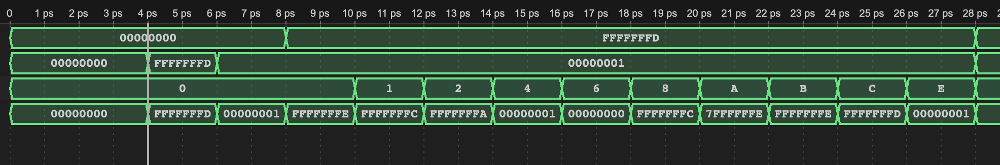
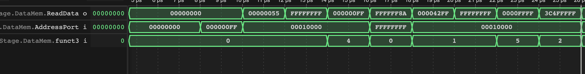
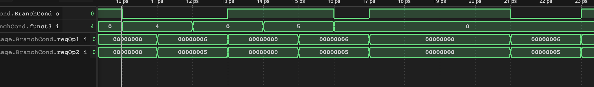
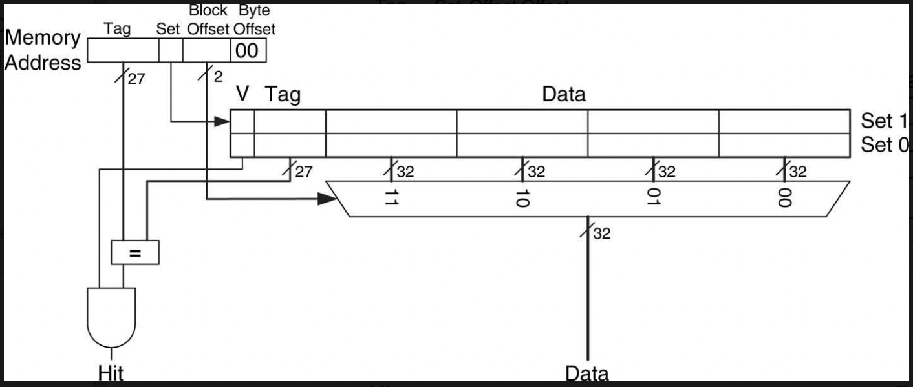

# Team 11 repo

## Summary of results

We managed to implement a fully pipelined RISC-V CPU (with hazard detection and forwarding) which also uses single level caching.

In a different branch (`neumann_multilevel`) we were even able to implement
a two level caching mechanism with split L1 cache for instructions and data and
unified L2 cache as well as main memory for both of them. This required dealing
with cache coherence between the two L1 caches and adding extra hazard detection
mechanisms to deal with writes to instruction memory.

## Team members and personal statements

| Name           | CID      | GitHub   | Email                     | Link to Personal Statement|
|----------------|----------|----------|---------------------------|--------------|
| | | | | |
| Constantin Kronbichler    | 02221910 | **ccrownhill** | ck622@ic.ac.uk     | [Constantin's Statement](statements/ConstantinKronbichler.md) |
| | | | | |
| | | | | |


## Repository structure

### Files and directories

* `rtl`: contains all SystemVerilog code
  * `riscvpipe.sv`: top level module
  * one top level module for every stage
  * ...

* `test`
  * Makefile for testing
  * assembly code and machine code
  * files to load into memory (e.g. distributions)

* `utilscripts`: scripts for converting between binary formats of memory files or machine code
  * `mem_to_bloc.py` to convert data memory file from bytes to n bit blocks
  * `TabRemove.py` to format code correctly
  * ...

### Branches

* `main`: contains pipelined CPU with forwarding and hazard detection along with single level write through caching

The following were built on top of the pipelined version:

* `writeback_caching`: implements single level writeback caching
* `neumann_cache`: implements a split instruction and data cache
with a unified main memory
* `neumann_multilevel`: 2 level cache:
  * split instruction and data cache for L1 (with write through)
  * uses simple write through snooping protocol for cache coherence between the two
  L1 caches
  * unified L2 cache (with write back)
  * Unified main memory

## Part 1: Single Cycle CPU

### Design

We referred to the book written by Harris & Harris, Control Unit as:


ALU section as:


ImmSrc as:


finally, the whole design as


### Evidence

This part test all the instructions of RV32I with I, S, R, B and J type instructions. 

**Test all instructions with ALU**

We started with editing ALU and to include all the R type and part of I type Instructions. The ALUdecoder has been edited to deal with R and I type intructions differently because the I type instruction do not have funct7 thus it should be identify whther is shift instructions. We also make the ALUctrl to 4 bits number so it is enough to includes all instructions. Here is the testing result:
We have the assembly testing program(ALUtest.s):

```
addi a1, zero, -3
addi a2, zero, 1
add a0, a1, a2
sub a0, a1, a2
sll a0, a1, a2
slt a0, a1, a2
sltu a0, a1, a2
xor a0, a1, a2
srl a0, a1, a2
sra a0, a1, a2
or  a0, a1, a2
and a0, a1, a2
```

The wave we have for this test shown below and all the result matches, last signal refer to the result a0:



**Test all memory instructions (lb, lh, lw, lbu, lhu, sb, sh and sw)**

Then to test all the load and store instructions are working proporly, we edited the data memory to enable more instructions.

The testing program (`load_store_test.s`):

```
lui a1, 0x10
li a2, 0xff
sb a2, 0(a1)
lb a0, 0(a1)
lbu a0, 0(a1)

addi a2, zero, -1
sh a2, 0(a1)
lh a0, 0(a1)
lhu a0, 0(a1)

sw a2, 0(a1)
lw a0, 0(a1)
``` 

The wave we got from this test shows the expected data:



**Test with all B type instructions (beq, bne, blt, bge, bltu and bgeu)**

For Branch instructions we added the `BranchCond` module to set a single bit signal
(`BranchCond`) according to whether the condition of each of the branch instructions
was fulfilled (we use `funct3` to decide which branch instruction we are dealing with).

The testing program(`Branch.s`):
```
main:
  li t0, 6
  li t1, 5
  li t4, 10
  li t5, 0

  blt t0, t1, Smaller
  li t2, 0
  bge t0, t1, Bigger_or_Equal
  bne t0, t4, not_EQ
  j end_test

Bigger_or_Equal:
  li t2, 1
  beq t0, t1, EQ
  li t3, 1        # t2,t3,t5 = 111 if t0 is bigger than t1
  j end_test
Smaller:
  li t3, 0        # t2,t3,t5 = 001 if t0 smaller than t1 
EQ:
  li t3, 0        # t2,t3,t5 = 100 if t0 equal to t1
not_EQ:
  li t5, 1

end_test:
```
The wave we got is the same with what we expexted as the 6 is bigger and not equal to 5:



Thus we have include all the RV32I integer instruction and finish testing them worked functionally.

**Test of PDF Distributions**

It can be seen that our design displays everything correctly for all 4 distributions:

Expected triangular distribution from Excel:


This is included just to show we are using the correct data as the PDF of the triangle distribution is not as theoretically expected. 
This is because some values in the range 0 - 255 never occur which causes the PDF to shoot to zero at these values which is why the distribution looks so strange.


Gaussian Distribution:


Noisy Distribution:


Sin Distribution:


These images show that our CPU works exactly as expected as it produces the same results that we expect from the excel plots.

The only minor issue is the display of Vbuddy does not show the sin wave function very accurately. 

However this is a limitation of the display and not our CPU itself.
Overall we are very happy with the results we recieved and our SingleCycleCPU has been a success.


**Test for the F1-FSM**

Before the hardware design phase, Our team created the assembly language program to implement the F1 starting light algorithms:

```
.text
.equ NORMAL_DELAY, 24
.equ NLIGHTS, 0xff
.equ SREG_INIT, 0b1111111

main:
	jal ra, init              # jump to init, ra and save position to ra
forever:
	j forever

init:        			  # function for initialise the output a0 and delay buffer
	li a0, 0
	li s1, NLIGHTS
	bne s0, zero, light_on    # if random delay = zero
	li s0, SREG_INIT          # then initial the delay 
	j light_on                # jump to light_on

light_on:   			  # function for modify the output a0 and reset
	li a1, NORMAL_DELAY
	jal ra, count_down
	slli a0, a0, 1            # left shift to make the next light on
	addi a0, a0, 1            # add 1 to make sure first light on after shift
	bne a0, s1, light_on      # check if all lights is on 
	jal ra, lfsr              # jump to lfsr if all lights on
	add a1, s0, zero          # assign the a1 count down buffer with random delay s0
	jal ra, count_down
	li a0, 0
	ret

count_down: 			  # function for countdown the delay of each light goes on
	addi a1, a1, -1
	bne zero, a1, count_down  # count down until 0
	ret

lfsr:       			  # function for modify the random delay of lights off
	slli s0, s0, 1            # shift left by 1
	srli t0, s0, 7            # get bit 6 of s0
	srli t1, s0, 3            # get bit 2 of s0
	andi t1, t1, 1            # make the t1 to 1 bit
	xor t0, t1, t0            
	add s0, s0, t0            # add the xor result to the last bit
	andi s0, s0, SREG_INIT    # make the s0 back to 7 bits
	ret
```

The program sets an initial delay between each light on and start the light_on function to allow lights on continuously by using shift left 1 bit and add 1 bit until all lights is on and then countdown a random delay s1 to turn off all lights. 

We successfully implemented the F1 light program as shown in the video linked below 

https://youtu.be/eAhKKpVeQog?si=jxR7XT2m2lLqG2_a

We used a timer to record the time taken from 8 lights on to 8 lights off as illustrated in the table below:

Attempt | #1 | #2 | #3 | #4 | 
--- | --- | --- | --- |--- |
Seconds | 3.95 | 4.61 | 5.89 | 5.10 |

The time interval from the current light on to the next light on is a constant, and the value is about 1.43 seconds

These results mean that we successfully generated random delay with LFSR.

## Stretch Goal 1: Pipelined RV32I Design

### Design

We chose to do a standard five stage pipeline

* `IF` Instruction Fetch
  * read instructions from instruction memory
  * PC register
  * `IF/ID` register between this and next stage
* `ID` Instruction Decode
  * decodes instruction into control signals
  * reads data from register file
  * `ID/EX` register between this and next stage
* `EX` Execute
  * computes ALU result
  * `EX/MEM` register between this and next stage
* `MEM` Memory
  * writes/reads the data memory
  * also writes new value of PC to input of PC register; the reason for this is that the PC register will introduce another cycle delay until its output changes; hence, we change it already before the last stage
  * `MEM/WB` register between this and next stage
* `WB` Write Back
  * writes data from memory or data from ALU output or next PC value (`jal`) to register file

Patterson p. 297

**IMPORTANT**: to avoid unnecessary extra stalls we designed the register file in
a slightly unconventional way into a latch

* it will be written during the entire first half of a clock cycle (clock high)
* it will be read in the second half

```verilog
always_latch begin
  if (clk == 1'b1) begin
    // AD3 != 0 because writing zero register has to stay 0	
    if (WE3 && AD3 != {ADDRESS_WIDTH{1'b0}}) begin
      reg_file[AD3] = WD3;   // Write data to port 3
    end
  end
  else if (clk == 1'b0) begin
    RD1 = reg_file[AD1];
    RD2 = reg_file[AD2];
    a0_o = reg_file[10];
  end
end
```

We know that this can also be done by configuring all other pipeline registers as
well as the register file to write on the negative edge of the clock and read
the register file on the positive edge but we sticked to this version because
it was already in place when we learned about the other option and it was best to
avoid merge conflicts with current development changes.


Pipelining was implemented in multiple steps:

**1. Insert pipeline registers between stages**

As in this picture we just inserted pipeline registers between the different stages.
These received all output signals of one stage as well as the control signals
that need to be passed to the next stage.

Patterson p. 299

That way it is possible to execute multiple different stages in parallel which means
less combinational logic needs to be done in one clock cycle which allows a big speedup.

In theory this gives a speedup up to `N` for `N` stages but in practice not all stages execute as fast
as the other stages and we also need to introduce stalls.

**2. Avoiding hazards**

There are two types of hazards in a pipelined CPU:

* *Data Hazards*: when an instruction needs data from a previous instruction that
has not yet reached the write back stage --> use FORWARDING
* `Control Hazards`: when we load a wrong instruction because the branch condition
of a branch instruction was not yet evaluated --> use stalls, move logic up in the pipeline, predicted fetches, and flush registers to delete predicted instruction load

**2.1. Avoiding data hazards**

In the `EX` stage in `ForwardingUnit.sv` we decide where our ALU operands should
come from:

* from the register file (if it contains the most up-to-date versions of what we need)
* from the ALU output stored in the `EX/MEM` register (if one operand is the output of the previous ALU instruction that was not yet written to memory)
* from the WB stage register file input if we need the second last instructions output

Then we use two MUXes for each operand that select the correct of these (the `Sel`
input comes from `ForwardUnit.sv`).

Why we need to stall for memory load instruction forwarding: Memory instruction output
is only available after the `MEM` stage that means that if the last instruction
before the current instruction is a `MEM` instruction its memory output will not
be available while the current instruction is starting the EX stage.
Hence we will stall for one cycle.

How to stall in `HazardDetectionUnit.sv`

* checks whether conditions for stall are fulfilled
	* whether stages further up will write to the register file at the same address
	as the current instruction
	* whether we have a memory load instruction in the MEM stage (then we need to stall)
* sets PC register enable and `IF/ID` register enable low
* sets all control signals in `ID` stage to zero so that we will not be writing to
the register file or memory during the stall

Patterson p. 325

**2.2. Avoiding control hazards**

Here we employed a smart technique to reduce the amount of stalls to 0 if the branch
condition does not make use of a register edited in the previous two instructions and
if our prediction of "branch not taken" was correct.

This was done by moving logic into the ID stage:

* comparing register operands directly from output of register file
* calculate PC + Immediate operand so that we don't need to wait for the EX stage

This means that in many cases all the information which instruction to load in the
following IF stage will be available and we don't need to stall.

However, we loose a cycle or two in the following scenarios:

1. 1 lost cycle: branch taken means that we already loaded the value at PC+4 from
the instruction memory while the new PC will only show on the PC register output
the next cycle. This means we need to set the instruction in the `IF/ID` register
to 0 to make it like a nop

1. up to 2 lost cycles: if the branch depends on the previous instruction's output
we need to stall for 2 cycles until the result is in the register file or 1 cycle
if it was the second last instruction's output.

The Hazard Detection unit was extended to allow for flushing:

* it flushes under this condition: (`Branch_i` for branch instruction, `BranchCond` when condition is fulfilled, `Jump` for `jal` instruction and `Ret` for `jalr` instruction as set in decode logic of `ID` stage):

```verilog
((Branch_i == 1'b1 && BranchCond_i == 1'b1) || Jump_i == 1'b1 || Ret_i == 1'b1)
```

* it stalls under this condition (up to two cycles when register for comparison
was not yet written):

```verilog
if ((Branch_i == 1'b1 || Ret_i == 1'b1) // check if it is branch or jalr 
// check whether instruction in EX stage will write to register file         
&&    ((((rs1_IF_ID_i == rd_ID_EX_i || rs2_IF_ID_i == rd_ID_EX_i) && rd_ID_EX_i != 5'b0) && RegWrite_ID_EX_i == 1'b1)
// check whether instruction in MEM stage will write to register file        
    || (((rs1_IF_ID_i == rd_EX_MEM_i || rs2_IF_ID_i == rd_EX_MEM_i) && rd_EX_MEM_i != 5'b0) && RegWrite_EX_MEM_i == 1'b1)))
```

Note the checks to ignore writes to the zero register because these will not change
anything and should therefore not result in stalls.

Patterson p. 333

### Evidence

* `F1_light` can be successfully run on Vbuddy with noticeable longer time interval, around 3.1 seconds and 130 cycles, from current light on to next light on. However, the time interval for non-pipelined version is around 1.5 seconds and 60 cycles. This sounds weird because Verilator lock the clock speed to 2ps/cycle (in reality, the clock speed will be increased since only the logic of one stage is executed in one cycle instead of 5 stages). This shows that we pipelined the instructions successfully.

* *Guassian*, *Noisy*, *Sine*, and *Triangle* distributions can be plotted on Vbuddy with noticeable slower plotting speed compared to non-pipelined version, which means plotting instructions can be successfully run with pipelined hardware, reason as explained above. 

Here is a video comparison when `Noisy.mem` is run on a pipelined version and a non-pipelined one


https://github.com/ccrownhill/Team11/assets/109323873/f035e546-bae7-4a60-9108-87be6d8bb2ff


https://github.com/ccrownhill/Team11/assets/109323873/5ed6b64c-92a2-4eb5-ac90-768da428ab14


Here is graphical evidence related to other `.mem` files executed on pipelined version:

NOTE: testbench has been modified, the step length now is 7 which was 3 for non-pipelined version in order to narrow the plots (make pipelined plots looked the same as non-pipelined version).

`Triangle.mem` as shown:


`Gaussian.mem` as shown:


`Sine.mem` as shown:


Obviously, non-pipelined hardware can work correctly since pipelined hardware does work correctly


## Stretch Goal 2: Pipelined RV32I Design with Cache

# Caching

## initial design choices

This is the overall design we have chosen.

Cache size: 128 Words total capacity which is 512 bytes.
4 degrees of associative: Tracking least used by splitting the ways into two groups, tracking the least used group and randomly eliminating a way within the least used group when necessary.
16 Bytes in a block 
8 Sets total
4 blocks in a set
total number of blocks = 32
We will only have one level of cache. (To begin)
We will initially have a writethrough cache.

This is an example of a cache. For our purposes the 32 bit input to the mux will be 8 bit and our mux will be much larger to enable every byte to be individually addressed.


Inputs and outputs names:
Top Level Memory:  Memory.sv
on startup all data should be wiped and all V bits set to 0
inputs: 
- clk
- Addr_i [31:0]
- WriteD_i [31:0]
- Mwrite_i
- Mread_i
- funct3_i [2:0]
- ReadD_o [31:0]
- Mready_o

The cache itself: Cache.sv
- Valid_i
- Wen_i
- funct3_i [2:0]
- Addr_i [31:0] // this will form the various parts of the address such as tag and byte offset.
- WordData_i[31:0]
- HalfData_i [15:0]
- ByteData_i [7:0] 
- clk
- WordData_o [31:0]
- HalfData_o [15:0]
- ByteData_o [7:0] 
- Cready_o

The main memory: MainMemory.sv
- Valid_i
- Wen_i
- clk
- Addr_i [31:0]
- WriteD_i [127:0]
- ReadD_o [127:0] // on a miss the cache is updated with the missing block. Then the cache will read the desired byte and output it back to the cpu
- Ready_o

The 16 mux: Mux16.sv
Follows conventions of previous Muxs

Sign extender for the byte and half word outputs: MemExtend.sv
- WordData_i[31:0]
- HalfData_i [15:0]
- ByteData_i [7:0] 
- funct3_i [2:0]
- ExtD_o [31:0]

To split up this task we have done:
Constantin will be integrating the modules into the CPU.
Orlan will create Cache.sv
Pan will create MainMemory.sv and MemExtend.sv
Seb will create Mux16.sv and helping others with any issues

Introducing caching into our CPU was a very large task and because of the nature of the task it was very important to have set variable names. This would make connecting it in the top level much easier. It was a very fun but challenging task and we worked well as a team to achieve it. We decided to only implement l1 cache as this would be enough for our purposes.

The largest design choice we made was certainly making the cache byte addressed. We realised that the test program only used LB and SB instructions. This means that we could make better use of a cache by making it byte addressable. In this way we increased the amount of data our cache could store without increasing the size of it. We picked the size of our cache to be a reasonable size that could theoretically be implemented in a real CPU. Our block size was chosen to be quite large as we realised for the programs we will be running spatial locality would be very helpful in increasing the hit rate.

Testing the performance improvements from the cache is difficult as we cannot simulate different delay times with fetching values from memory very easily. However assuming that our cache allows us to fetch form l1 in 2 cycle and form main memory in 100 cycles our cache should enable a significant speed increase in a real CPU. This is probably the single biggest improvement to our CPU we have made as pipelining our CPU with 5 stage could cause between a 3-5 times increase in clock frequency, but the cache could be 10 times faster assuming a decent hit rate.

The cache is 4 way set associative which should allow it to hold a large amount of data for plotting different distributions but in the case where some data must be replaced it selects the last used way using a shift register which allows us to make use of temporal locality. In these ways we take advantage of the principles of both spatial and temporal locality which again should improve our hit rate.

The cache itself was implemented using a state machine which tracks what needs to be done by moving through the stages before outputting the correctly fetched value or writing the correct block in memory and awaiting the next instruction. There is logic in the hazard detection to make sure that if there is a delay, from not getting a cache hit or from a write instruction, the pipeline is stalled until this instruction is executed fully. We have not implemented out of order execution.

## Next Steps

If given more time there are two features that would be very interesting to implement. Including out of order execution would certainly speed up the CPU as we could have the cache operating somewhat independently of the main CPU. For example if a write instruction was followed by many register instructions we would not have to stall as the cache could write memory while the register instructions happen in parallel. Another very interesting feature would be pre-fetching instructions. This would be a huge speedup as it would allow us to massively improve our hit rate. With the sample program in particular this would be an 100% hit rate as the plotting of the distribution is massively predictable. This would be the most intersting feature as writing an effective algorithm would be a fascinating challenge.

## Performance

Our performance for our cache cannot be measured in real time but we can assess the hitrate which is an indicator as to how well it will perform. In the example program we achieve an average hitrate of 94%. This is because the example program is very predictable. Since it accesses data incremently every single byte in our block will be accessed. Because of this the only misses we have are when crossing a cache boundary and thus causing a new block to be fetched. As we do not have prefetching these are mandatory misses and so the only improvements we could make would be either increasing the number of bytes in a block. Or implementing some method of prefetching. 

More cycles are used when running the program with the cache as misses add cycles that otherwise would not be there. However assuming a good hitrate there is minimal increase to the number of cycles. If we take into account the theoretical incease from the cache allowing faster reading than main memory it is clear our cache would massively speed up the CPU as a whole. 

Our final version is a write through cache as we thought this was our best version overall. However we did also implement a write back cache. The write through was more complete however the write through did have an edge when it came to performance. This is because it did not have to write main memory every time a cache location was updated. This comes with its own issues however as your main memory and cache memory are not syncronised which causes issues when overwriting a cache location that stores data not yet written to main memory. This requires use of a dirty bit and when it is required to write to main memory there is a large delay because of this since you must write main memory then read the new data and finally rewrite the cache. This means that while write back may be more efficient overall there is more consistency with a write through cache and it offers a more than good enough performance increase while keeping testing and implementation much simpler.
So in the end we picked our write through cache as our final result due to a greater confidence in the design and minimal performance difference between the two designs.

## Proof

We successfully ran the files on the pipelined CPU with the cache.

For the F1 light, we manually changed the time interval and used a 4-bit linear feedback shift register as the random delay in the `f1_light.s` file. That way, the lights can cycle through quicker than before.


https://github.com/ccrownhill/Team11/assets/109323873/6579ed6d-6fa6-4562-9b76-db219395564b

We also tested the distributions and they run as shown.

[Proof of working gaussian](Gaussian_proof.HEIC)

## Testing

### Test benches

For all tests the CPU will read machine code instructions from `test/instructions.mem`
and initiate its data memory with `test/data.mem` (at address `0x10000`).

* `riscvpipe_dist_tb.cpp`: will connect to Vbuddy and plot distribution

Note that in the simulation loop we only start displaying the wave after the first
non-zero value has been reached which we achieve using this if-statement:

```cpp
if (top->a0 != 0)
	started = true;
```

The other problem is that the `display` loop of the assembly program consists of
instructions that will not change the value of the `a0` register.
When we use pipelining and caching there will be oven more cycles delay between
changes of the `a0` value.
To avoid making the waveform look to stretched we added an integer variable `count`
that will count to some number of cycles before displaying another copy of `a0`.
Initially we adjusted `count` to the number of instructions between the `lbu` instructions but with caching and pipelining we just used a number that made
the waveform fit on the screen:

```cpp
if (started) {
	if (++count == 7) {
		vbdPlot(int(top->a0) & 0xff, 0, 255);
		count = 0;
	}
}
```

* `riscvpipe_f1_tb.cpp`: will run the program `f1_light.s` (in `test`) on our CPU
and use `a0` to set the lights of the Vbuddy accordingly

* `riscvpipe_simple_tb.cpp`: will just run the program and output `riscvpipe.vcd`
which can then be examined using `gtkwave` (this was especially useful for debugging)

### Running with the Makefile

Note that the Makefile is in `test` and you can only run it from that directory.

* Test probability function on VBuddy (will automatically change `instructions.mem` and `data.mem`)

```
make distfile.mem
```

**IMPORTANT**: needs `.mem` extension.

* Test F1 light on VBuddy (will automatically change `instructions.mem`)

```
make f1
```

* Run a generic test bench file ending in `_tb.cpp`:

```
make my_tb.cpp
```

where `my` should be replaced by the actual name.

* For debugging: run with `gtkwave`

```
make gtkwave
```

* For debugging: Get all verilator warnings (none suppressed);

```
make warnings
```
