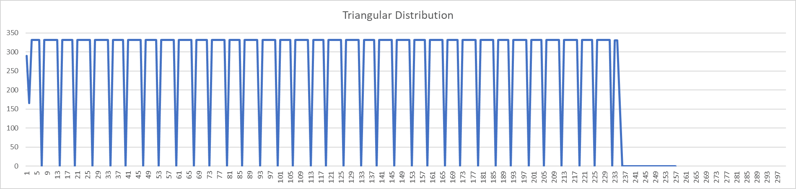
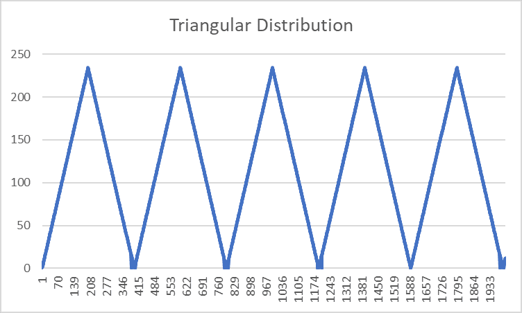
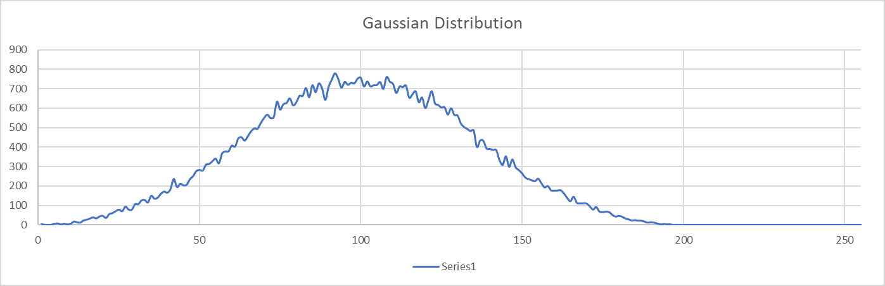
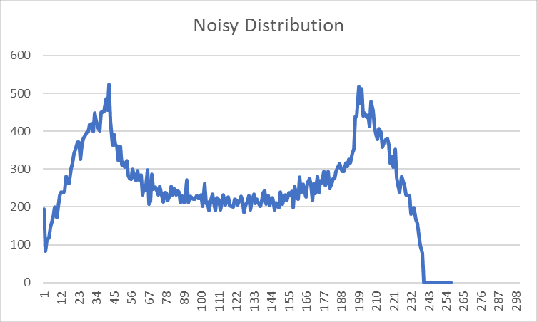
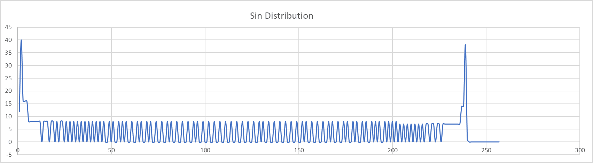

This readme contains images of the expected data plotted using excel and the aquired data from our program using vbuddy.

It can be seen that our design displays everything correctly

Triangular Distribution from Excel:

Gaussian Distribution:

Noisy Distribution:

Sin Distribution:

