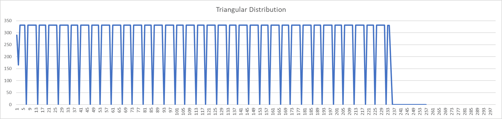
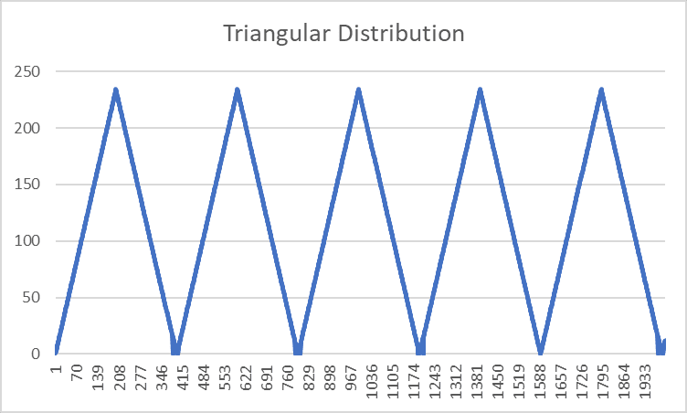
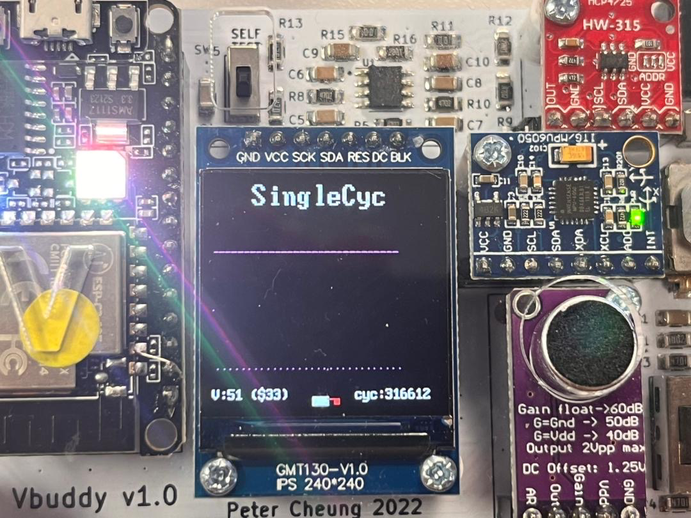
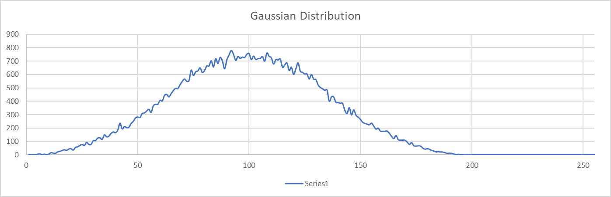
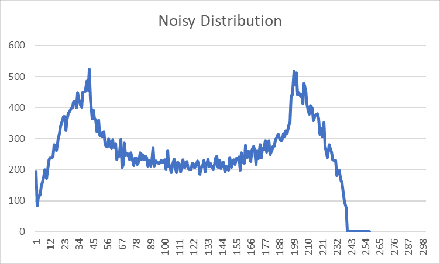
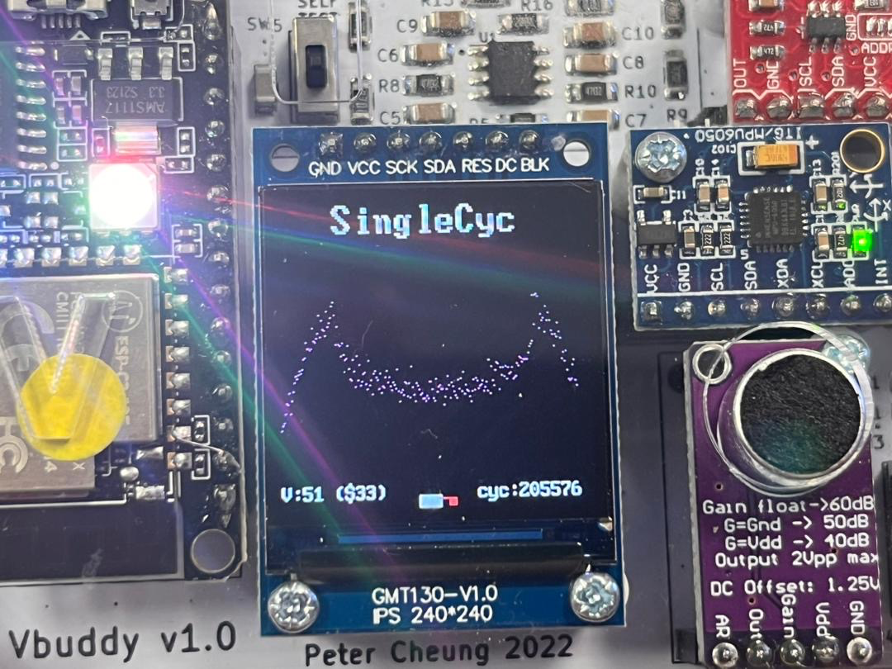
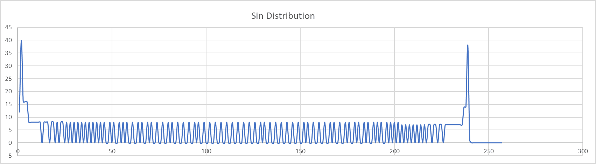
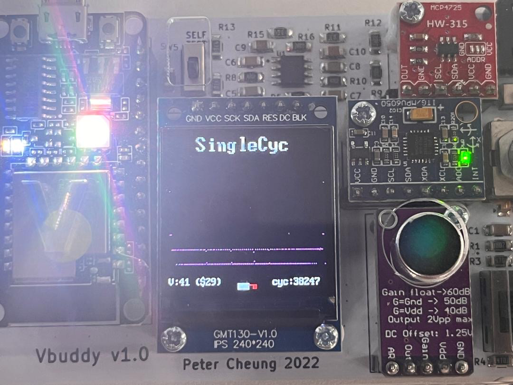

# Test 

## Running tests using the Makefile

Note that the CPU expects the instructions in 4 byte words in `instructions.mem`
and the data for the data memory in groups of 1 byte in `data.mem`.

* Test probability function on VBuddy (will automatically change `instructions.mem` and `data.mem`)

```
make distfile.mem
```

**IMPORTANT**: needs `.mem` extension.

* Test F1 light on VBuddy (will automatically change `instructions.mem`)

```
make f1
```

* For debugging: run with `gtkwave`

```
make gtkwave
```

* For debugging: Get all verilator warnings (none suppressed);

```
make warnings
```

## Test of PDF Distributions

This readme contains images of the expected data plotted using excel and the aquired data from our program using vbuddy.

It can be seen that our design displays everything correctly for all 4 distributions:


Triangular Distribution from Excel:



This is included just to show we are using the correct data as the PDF of the triangle distribution is not as theoretically expected. 
This is because some values in the range 0 - 255 never occur which causes the PDF to shoot to zero at these values which is why the distribution looks so strange.



Gaussian Distribution:



Noisy Distribution:




Sin Distribution:




These images show that our CPU works exactly as expected as it produces the same results that we expect from the excel plots.
The only minor issue is the display of vbuddy does not show the sin wave function very accurately. 
However this is a limitation of the display and not our CPU itself.
Overall we are very happy with the results we recieved and our SingleCycleCPU has been a success.


## Test for the F1-FSM

Before Hardware design, Our team creat the assembly language program to implement the F1 starting light algorithms:

```
.text
.equ NORMAL_DELAY, 24
.equ NLIGHTS, 0xff
.equ SREG_INIT, 0b1111111

main:
	jal ra, init              # jump to init, ra and save position to ra
forever:
	j forever

init:        			  # function for initialise the output a0 and delay buffer
	li a0, 0
	li s1, NLIGHTS
	bne s0, zero, light_on    # if random delay = zero
	li s0, SREG_INIT          # then initial the delay 
	j light_on                # jump to light_on

light_on:   			  # function for modify the output a0 and reset
	li a1, NORMAL_DELAY
	jal ra, count_down
	slli a0, a0, 1            # left shift to make the next light on
	addi a0, a0, 1            # add 1 to make sure first light on after shift
	bne a0, s1, light_on      # check if all lights is on 
	jal ra, lfsr              # jump to lfsr if all lights on
	add a1, s0, zero          # assign the a1 count down buffer with random delay s0
	jal ra, count_down
	li a0, 0
	ret

count_down: 			  # function for countdown the delay of each light goes on
	addi a1, a1, -1
	bne zero, a1, count_down  # count down until 0
	ret

lfsr:       			  # function for modify the random delay of lights off
	slli s0, s0, 1            # shift left by 1
	srli t0, s0, 7            # get bit 6 of s0
	srli t1, s0, 3            # get bit 2 of s0
	andi t1, t1, 1            # make the t1 to 1 bit
	xor t0, t1, t0            
	add s0, s0, t0            # add the xor result to the last bit
	andi s0, s0, SREG_INIT    # make the s0 back to 7 bits
	ret
```

The program firstly initial a delay between each light on and start the light_on function to allow lights on continuously by using shift left 1 bit and add 1 bit until all lights is on and then countdown a random delay s1 to turn off all lights. 

After we use online assembler to get the f1_light.s test file with our assembly language program we unload it to the instruction memory. We successfully implemented the F1 light program as shown in the video linked below 

https://youtu.be/eAhKKpVeQog?si=jxR7XT2m2lLqG2_a

We used a timer to record the time taken from 8 lights on to 8 lights off as illustrated in the table below:

Attempt | #1 | #2 | #3 | #4 | 
--- | --- | --- | --- |--- |
Seconds | 3.95 | 4.61 | 5.89 | 5.10 |

The time interval from the current light on to the next light on is also a constant, and the value is about 1.43 seconds

These results mean that we successfully generated random delay with LFSR.

