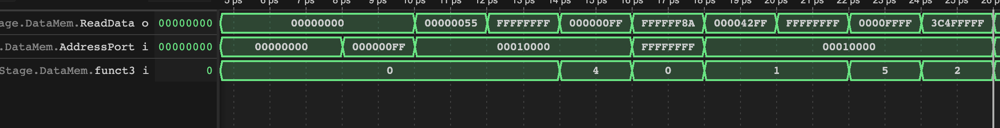
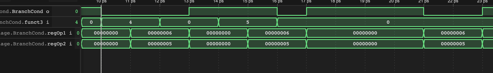

# Evidence of our working CPU

## Single Cycle

This part test all the instructions of RV32I with I, S, R, B and J type instructions. 

### Test all instructions with ALU

We started with editing ALU and to include all the R type and part of I type Instructions. The ALUdecoder has been edited to deal with R and I type intructions differently because the I type instruction do not have funct7 thus it should be identify whther is shift instructions. We also make the ALUctrl to 4 bits number so it is enough to includes all instructions. Here is the testing result:
We have the assembly testing program(ALUtest.s):

```
addi a1, zero, -3
addi a2, zero, 1
add a0, a1, a2
sub a0, a1, a2
sll a0, a1, a2
slt a0, a1, a2
sltu a0, a1, a2
xor a0, a1, a2
srl a0, a1, a2
sra a0, a1, a2
or  a0, a1, a2
and a0, a1, a2
```

The wave we have for this test shown below and all the result matches, last signal refer to the result a0:


### Test all memory instructions (lb, lh, lw, lbu, lhu, sb, sh and sw)

Then to test all the load and store instructions are working proporly, we edited the data memory to enable more instructions.

The testing program (`load_store_test.s`):

```
lui a1, 0x10
li a2, 0xff
sb a2, 0(a1)
lb a0, 0(a1)
lbu a0, 0(a1)

addi a2, zero, -1
sh a2, 0(a1)
lh a0, 0(a1)
lhu a0, 0(a1)

sw a2, 0(a1)
lw a0, 0(a1)
``` 

The wave we got from this test shows the expected data:



### Test with all B type instructions (beq, bne, blt, bge, bltu and bgeu)

For Branch instructions we added the `BranchCond` module to set a single bit signal
(`BranchCond`) according to whether the condition of each of the branch instructions
was fulfilled (we use `funct3` to decide which branch instruction we are dealing with).

The testing program(`Branch.s`):
```
main:
  li t0, 6
  li t1, 5
  li t4, 10
  li t5, 0

  blt t0, t1, Smaller
  li t2, 0
  bge t0, t1, Bigger_or_Equal
  bne t0, t4, not_EQ
  j end_test

Bigger_or_Equal:
  li t2, 1
  beq t0, t1, EQ
  li t3, 1        # t2,t3,t5 = 111 if t0 is bigger than t1
  j end_test
Smaller:
  li t3, 0        # t2,t3,t5 = 001 if t0 smaller than t1 
EQ:
  li t3, 0        # t2,t3,t5 = 100 if t0 equal to t1
not_EQ:
  li t5, 1

end_test:
```
The wave we got is the same with what we expexted as the 6 is bigger and not equal to 5:



Thus we have include all the RV32I integer instruction and finish testing them worked functionally.

### Test of PDF Distributions

It can be seen that our design displays everything correctly for all 4 distributions:

Expected triangular distribution from Excel:


This is included just to show we are using the correct data as the PDF of the triangle distribution is not as theoretically expected. 
This is because some values in the range 0 - 255 never occur which causes the PDF to shoot to zero at these values which is why the distribution looks so strange.


Gaussian Distribution:


Noisy Distribution:


Sin Distribution:


These images show that our CPU works exactly as expected as it produces the same results that we expect from the excel plots.

The only minor issue is the display of Vbuddy does not show the sin wave function very accurately. 

However this is a limitation of the display and not our CPU itself.
Overall we are very happy with the results we recieved and our SingleCycleCPU has been a success.


### Test for the F1-FSM

Before the hardware design phase, Our team created the assembly language program to implement the F1 starting light algorithms:

```
.text
.equ NORMAL_DELAY, 24
.equ NLIGHTS, 0xff
.equ SREG_INIT, 0b1111111

main:
	jal ra, init              # jump to init, ra and save position to ra
forever:
	j forever

init:        			  # function for initialise the output a0 and delay buffer
	li a0, 0
	li s1, NLIGHTS
	bne s0, zero, light_on    # if random delay = zero
	li s0, SREG_INIT          # then initial the delay 
	j light_on                # jump to light_on

light_on:   			  # function for modify the output a0 and reset
	li a1, NORMAL_DELAY
	jal ra, count_down
	slli a0, a0, 1            # left shift to make the next light on
	addi a0, a0, 1            # add 1 to make sure first light on after shift
	bne a0, s1, light_on      # check if all lights is on 
	jal ra, lfsr              # jump to lfsr if all lights on
	add a1, s0, zero          # assign the a1 count down buffer with random delay s0
	jal ra, count_down
	li a0, 0
	ret

count_down: 			  # function for countdown the delay of each light goes on
	addi a1, a1, -1
	bne zero, a1, count_down  # count down until 0
	ret

lfsr:       			  # function for modify the random delay of lights off
	slli s0, s0, 1            # shift left by 1
	srli t0, s0, 7            # get bit 6 of s0
	srli t1, s0, 3            # get bit 2 of s0
	andi t1, t1, 1            # make the t1 to 1 bit
	xor t0, t1, t0            
	add s0, s0, t0            # add the xor result to the last bit
	andi s0, s0, SREG_INIT    # make the s0 back to 7 bits
	ret
```

The program sets an initial delay between each light on and start the light_on function to allow lights on continuously by using shift left 1 bit and add 1 bit until all lights is on and then countdown a random delay s1 to turn off all lights. 

We successfully implemented the F1 light program as shown in the video linked below 

https://youtu.be/eAhKKpVeQog?si=jxR7XT2m2lLqG2_a

We used a timer to record the time taken from 8 lights on to 8 lights off as illustrated in the table below:

Attempt | #1 | #2 | #3 | #4 | 
--- | --- | --- | --- |--- |
Seconds | 3.95 | 4.61 | 5.89 | 5.10 |

The time interval from the current light on to the next light on is a constant, and the value is about 1.43 seconds

These results mean that we successfully generated random delay with LFSR.


### Pipelined CPU

* `F1_light` can be successfully run on Vbuddy with noticeable longer time interval, around 3.1 seconds and 130 cycles, from current light on to next light on. However, the time interval for non-pipelined version is around 1.5 seconds and 60 cycles. This sounds weird because Verilator lock the clock speed to 2ps/cycle (in reality, the clock speed will be increased since only the logic of one stage is executed in one cycle instead of 5 stages). This shows that we pipelined the instructions successfully.

* *Guassian*, *Noisy*, *Sine*, and *Triangle* distributions can be plotted on Vbuddy with noticeable slower plotting speed compared to non-pipelined version, which means plotting instructions can be successfully run with pipelined hardware, reason as explained above. 

Here is a video comparison when `Noisy.mem` is run on a pipelined version and a non-pipelined one


https://github.com/ccrownhill/Team11/assets/109323873/f035e546-bae7-4a60-9108-87be6d8bb2ff


https://github.com/ccrownhill/Team11/assets/109323873/5ed6b64c-92a2-4eb5-ac90-768da428ab14


Here is graphical evidence related to other `.mem` files executed on pipelined version:

NOTE: testbench has been modified, the step length now is 7 which was 3 for non-pipelined version in order to narrow the plots (make pipelined plots looked the same as non-pipelined version).

`Triangle.mem` as shown:


`Gaussian.mem` as shown:


`Sine.mem` as shown:


Obviously, non-pipelined hardware can work correctly since pipelined hardware does work correctly


### Caching

We successfully ran the files on the pipelined CPU with the cache.

For the F1 light, we manually changed the time interval and used a 4-bit linear feedback shift register as the random delay in the `f1_light.s` file. That way, the lights can cycle through quicker than before.


https://github.com/ccrownhill/Team11/assets/109323873/3f1e5aec-fca1-42b9-b6e8-d10ca1525932


We also tested the distributions and they run as shown.(Note: All distributions are run on Pipelined CPU with cache, We forgot to change the title from "Pipelined" to "Caching")

Gaussian:


Sine:


Triangle:


Noisy:


#### Write-Back and Write-Through Caching

Here is a comparison between write-back caching and write-through caching. It can be seen that the write-back caching runs faster than write-through caching because write-back caching optimizes for performance by delaying the slower write operations to main storage, accepting the trade-off of potential data consistency issues in certain failure scenarios. The choice between write-back and write-through caching depends on the specific requirements and priorities of the system in terms of performance, data integrity, and fault tolerance.

Write Back:


Write Through:


